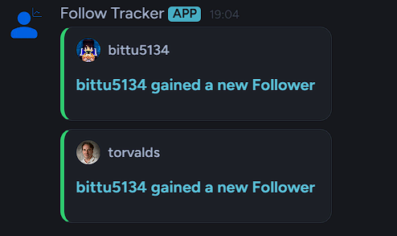
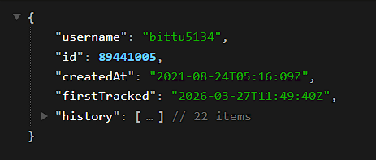

<p align="center">
  

  <h1 align="center" id="github-follow-tracker">Github Follow Tracker</h1>
  <h3 align="center">Fetch, Track and Showcase your Follow History.</h3>
</p>

<!-- Badges -->
<p align="center">
  <a href="#">
    
  </a>
  <a href="#">
    
  </a>
  <a href="https://discord.gg/CZdNvKaNNr" target="_blank">
    
  </a><br>
    <a href="https://follow.lazybittu.workers.dev/editor" target="_blank">
    
  </a> 
    <a href="https://follow.lazybittu.workers.dev/dashboard" target="_blank">
    
  </a>
</p>

## About This Project

GitHub natively tracks repository stars, but lacks a built-in historical timeline for followers. This project fixes that by adding a persistent tracking layer to the GitHub API so you can monitor, automate, and showcase your account growth.

- [Profile Readme Widgets](https://github.com/Bittu5134/GH-Follow-Tracker/wiki/Readme-Widgets)
- [Github Actions Integration](https://github.com/Bittu5134/GH-Follow-Tracker/wiki/Webhooks-&-Actions)
- [Webhook Integration](https://github.com/Bittu5134/GH-Follow-Tracker/wiki/Webhooks-&-Actions)
- [REST API](https://github.com/Bittu5134/GH-Follow-Tracker/wiki/REST-API)

> [!IMPORTANT]
> Due to Github API limits, only users who **`Star This Repository`** will be tracked for now.

## Features 

<table>
  <tr>
    <td width="60%">
      <h3>🖼️ Readme Widgets</h3>
      <p>Get beautifully formatted SVG Widgets for your profile page that show your account growth over time.</p>
      <p>Full control over customization: colors, size, and geometry.</p>
      <a href="https://follow.lazybittu.workers.dev/editor"><b>Web Editor ↗</b></a> | 
      <a href="https://follow.lazybittu.workers.dev/themes"><b>View Demo ↗</b></a>
      | <a href="https://github.com/Bittu5134/GH-Follow-Tracker/wiki/Readme-Widgets"><b>Documentation ↗</b></a>
    </td>
    <td width="40%" align="center">
      
    </td>
  </tr>

  <tr>
    <td width="60%">
      <h3>🪝 Webhook & Actions</h3>
      <p>Automate your workflow with real-time updates. Receive POST payloads on gaining / losing followers on your custom endpoints.<br><br>Built in Support for Discord / Slack / Teams / Telegram / Github Dispatch Webhooks</p>
      <a href="https://follow.lazybittu.workers.dev/dashboard"><b>Dashboard ↗</b></a> | 
      <a href="https://github.com/Bittu5134/GH-Follow-Tracker/wiki/Readme-Widgets"><b>Documentation ↗</b></a>
    </td>
    <td width="40%" align="center">
      
    </td>
  </tr>

  <tr>
    <td width="60%">
      <h3>🔗 REST API</h3>
      <p>All the follower data collected by this project is avilable in the <a href="https://github.com/Bittu5134/GH-Follow-Tracker/tree/meta"><code>meta</code></a> branch of this repo, and can be accessed via the Github API.</p>
      <a href="https://github.com/Bittu5134/GH-Follow-Tracker/wiki/Readme-Widgets"><b>Documentation ↗</b></a>
    </td>
    <td width="40%" align="center">
      
    </td>
  </tr>
</table>

## Quickstart

1. **Star this repository** to opt-in and begin your historical tracking.
2. **Add the widget** to your GitHub Profile README by copying the snippet below:

```md
[](https://follow.lazybittu.workers.dev/user/<USERNAME>)
```

> [!TIP]
> Replace `<USERNAME>` with your actual GitHub username. 

For advanced customization, webhook triggers, or API access, refer to the [Features Table](#features) above.


## Why This Exists?

While the GitHub API provides in-depth data for most metrics, like historical timelines for repository stars but your follower count remains a static number. There is no native way to track history, trends, or specific follower events. 

This project bridges that gap by adding a persistent **"History Layer"** to the GitHub API.

* **The Problem:** GitHub shows you *who* follows you, but not *when* or *how* your audience has evolved over time.
* **The Solution:** This tool acts as a "flight recorder" for your profile, capturing daily snapshots and transforming them into a time-series database.
* **The Result:** You gain access to the "Follower Events" that GitHub doesn't natively provide, powering dynamic widgets, real-time webhooks, and historical insights.

## Limitations

To keep this project running smoothly while staying within the GitHub API’s good graces, there are a few necessary boundaries in place:
* **Opt-in Only:** Historical tracking is only enabled for users who **[star this repository](https://github.com/Bittu5134/GH-Follow-Tracker)**.
* **Hourly Cycle:** Data snapshots and updates occur every **60 minutes**.
* **Webhook Cap:** Maximum of **3 active webhooks** per user account.
* **Data Resolution:** Events are captured hourly. If your net follower change within a single hour is zero (e.g., +1 then -1), the specific events may be skipped.

>[!NOTE]
>These limits are subject to change as the project scales. If you are a power user with specific needs, feel free to open a discussion!

## Contributing

Feel free to **contribute**, open an **issue**, or suggest a **feature request**! all input is welcome!  
[Check out the Issues page.](https://github.com/Bittu5134/GH-Follow-Tracker/issues)

## ❤️ Support the Project

One of my aims during the development was to keep the hosting costs at minimum (or zero if possible) as a fun little challange for myself.

But still if this tool has helped you track your growth or improve your profile, consider supporting its development!

## Inspired By

Even though I built this project on a whim, I drew heavy inspiration from these really cool existing tools.

* **[Star History](https://star-history.com/)** – For the idea of transforming static counts into meaningful historical timelines.
* **[GH Archiver](https://github.com/coderstats/github-archiver)** – For the concept of persistent data snapshotting and long-term storage.
* **[GitHub Readme Stats](https://github.com/anuraghazra/github-readme-stats)** – The gold standard for beautifully formatted profile widgets and SVG customization.
