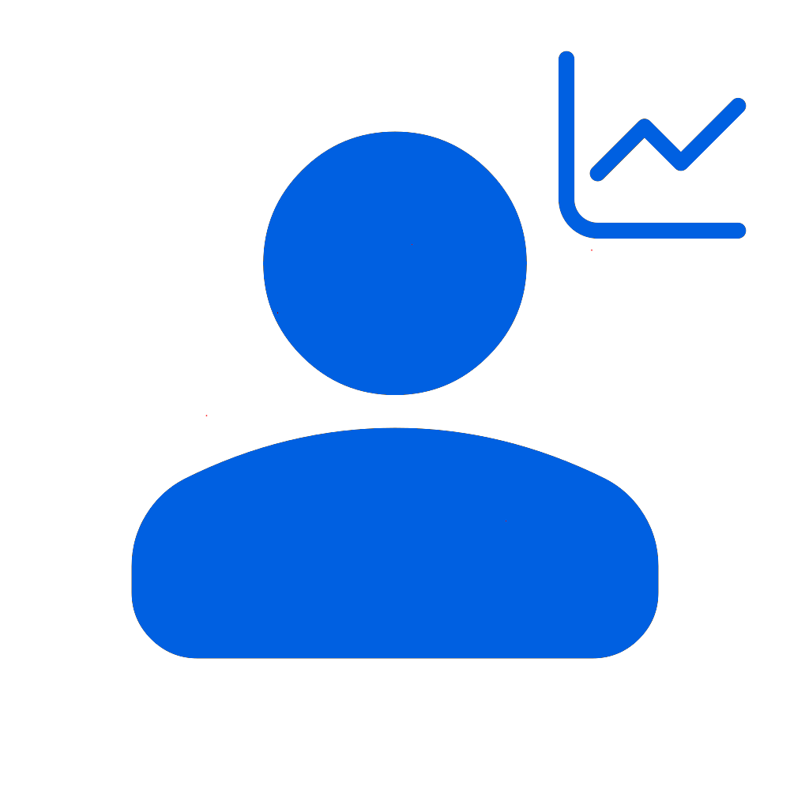
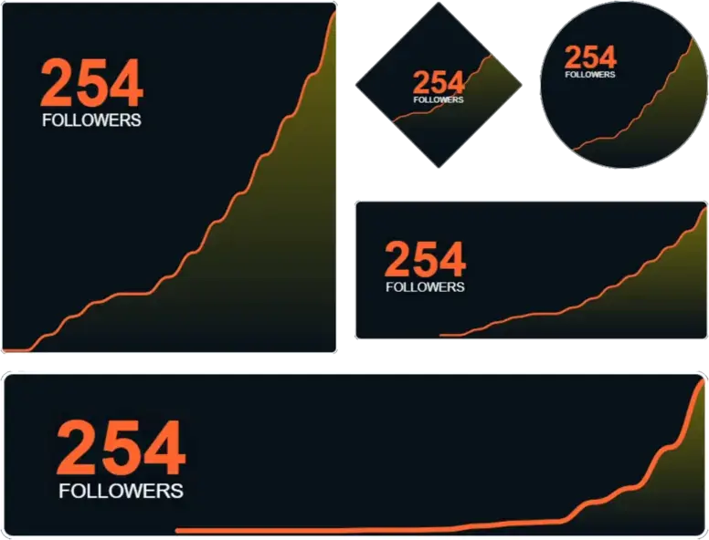
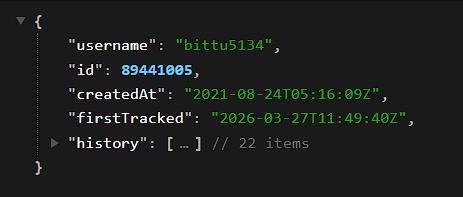

  

  <h1 align="center" id="github-follow-tracker">Github Follow Tracker</h1>
  <h3 align="center">Fetch, Track and Showcase your Follow History.</h3>

<!-- Badges -->

  &nbsp;
  &nbsp;
   
    &nbsp;  
    

## About This Project

This project aims to provide a simple way get follower interaction from the Github API along with a set of tools to interact with them. These are the current set of features offered by this project.

- Profile Readme Widgets
- Github Actions Integration
- Webhook Integration
- JSON API

> [!NOTE] Important Notice
> Due to Github API limits, only users who star this repository will be tracked for now.

## Features 

<table>
  <tr>
    <td width="60%">
      <h3>🖼️ Readme Widgets</h3>
      
Get beautifully formatted SVG Widgets for your profile page that show your account growth over time.

      
Full control over customization: colors, size, and geometry.

      <a href="https://follow.lazybittu.workers.dev/editor"><b>Open Editor ↗</b></a> |&nbsp;  
      <a href="https://follow.lazybittu.workers.dev/themes"><b>View Demo ↗</b></a>
      | <a href="https://follow.lazybittu.workers.dev/themes"><b>Documentation ↗</b></a>
    </td>
    <td width="40%" align="center">
      
    </td>
  </tr>

  <tr>
    <td width="60%">
      <h3>🪝 Webhook & Actions</h3>
      
Automate your workflow with real-time updates. Receive POST payloads on gaining / losing followers on your custom endpoints.  Built in Support for Discord / Slack / Teams / Telegram / Github Dispatch Webhooks

      <a href="https://follow.lazybittu.workers.dev/dashboard"><b>Dashboard ↗</b></a> | 
      <a href="#"><b>Documentation ↗</b></a>
    </td>
    <td width="40%" align="center">
      
    </td>
  </tr>

  <tr>
    <td width="60%">
      <h3>🔗 JSON API</h3>
      
All the follower data collected by this project is avilable in the <a href="https://github.com/Bittu5134/GH-Follow-Tracker/tree/meta"><code>meta</code></a> branch of this repo, and can be accessed via the Github API.

      <a href="#"><b>Documentation ↗</b></a>
    </td>
    <td width="40%" align="center">
      
    </td>
  </tr>
</table>